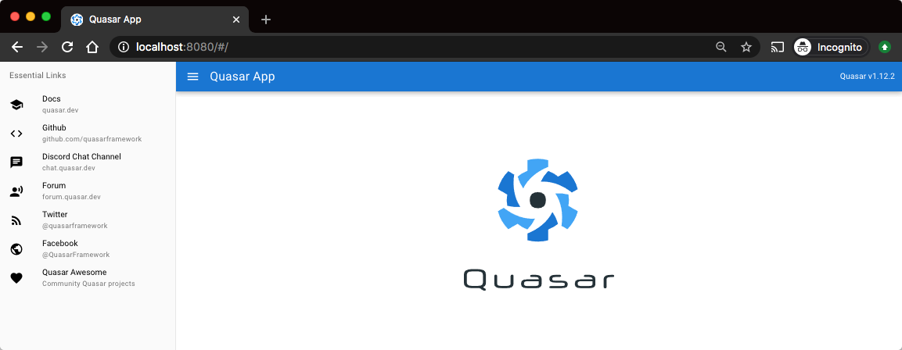
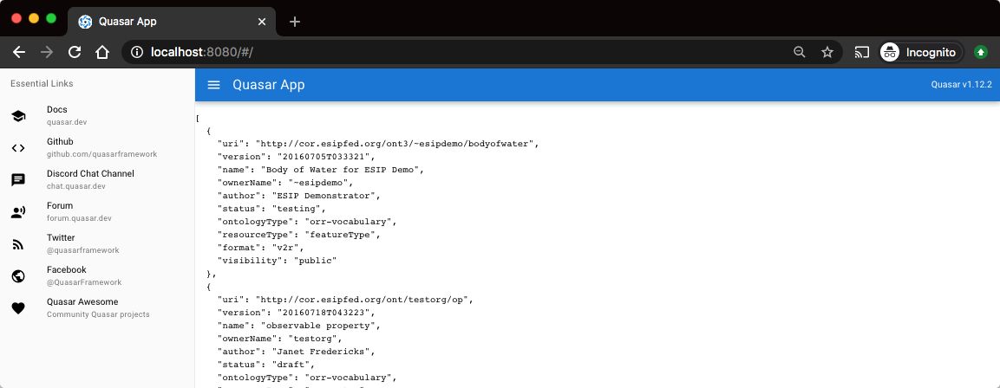
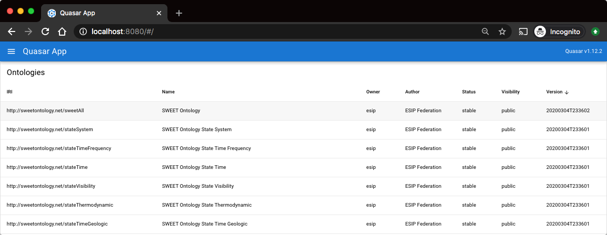

## project setup

First commit with only what `quasar create` creates:

```
$ quasar create orrui
...
$ cd orrui
$ quasar dev
```



----

A second commit with configuring axios to access the COR ORR API, getting the list of ontologies,
and displaying that list in the main index page, initially just displaying the JSON directly:



----

Using a q-table to show the ontology list:


