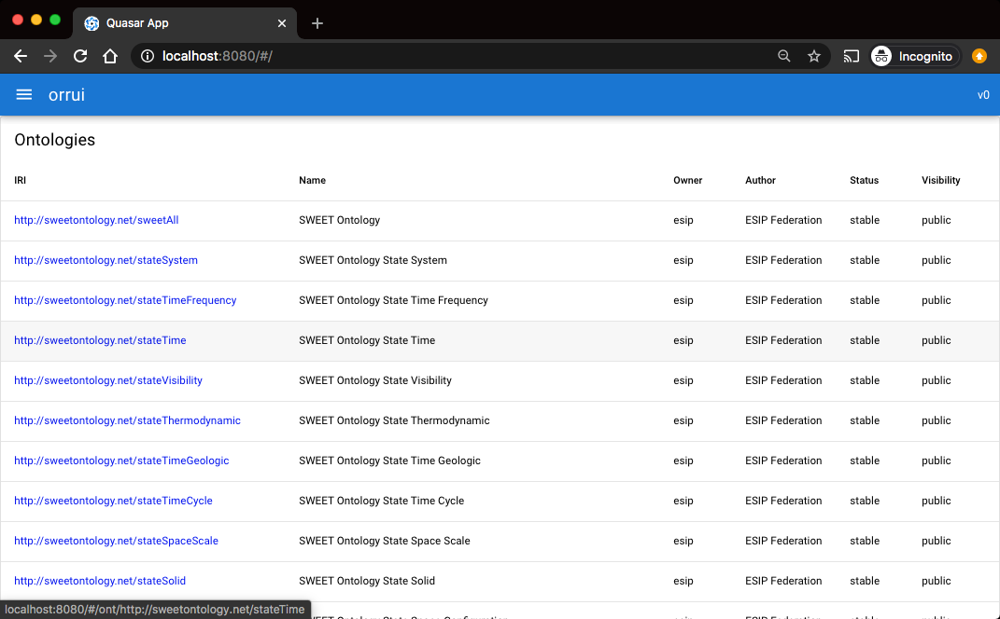
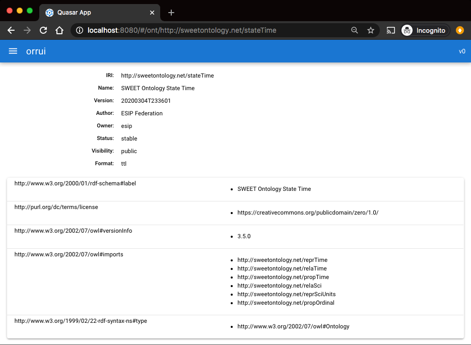
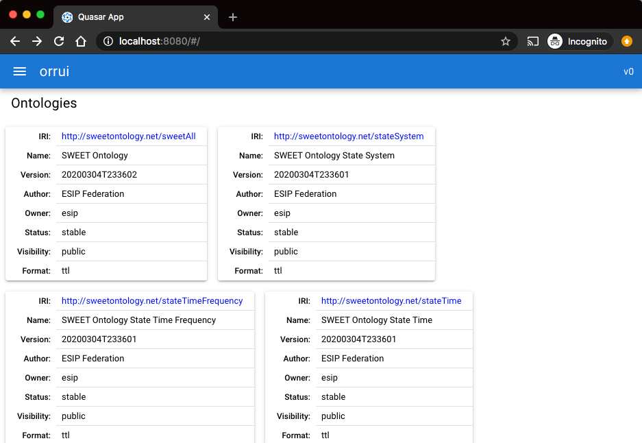

## project setup

First commit with only what `quasar create` creates:

```
$ quasar create orrui
...
$ cd orrui
$ quasar dev
```


----

A second commit with configuring axios to access the COR ORR API, getting the list of ontologies,
and displaying that list in the main index page, initially just displaying the JSON directly:

> 

----

Using a q-table to show the ontology list:


----

Add ontology links in main list:

> 

and add page to display an ontology:

> 

----

Add OntologySimple component to show basic information about a given ontology.
Used in the ontology page itself and also in the main page for narrow screens
(displayed in a responsive manner):

> 
